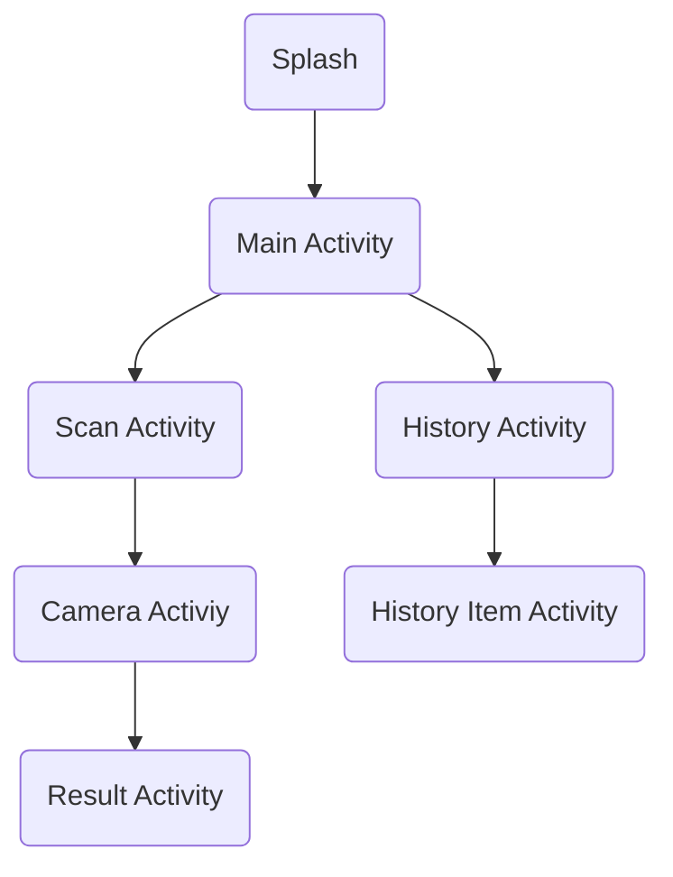

# Currency Sense
**Currency Sense: Financial Clarity At Your Fingertips**, Is an application developed to assist visually impaired people in identifying the value of money, by scanning the money. In addition, the application is made with a friendly UI design for the visually impaired. The application has a voice output that will notify you of the scan results, and a navigation location that can be used. 

## Organization

| NAME | LEARNING PATH |
|:--------------------:|:--------: |
| Chiquito Shaduq Aurick Fulvian |`Machine Learning`|
| Putri Rigita Cahyani |`Machine Learning`|
| Syifa'Ul Aini Zahroh |`Machine Learning`|
| Annadia Dwina Haqiqi |`Cloud Computing`|
| Muhammad Dafin Abiyasa |`Cloud Computing`|
| Devin Alfanius |`Mobile Development`|
| Riski Agung Romadhon |`Mobile Development`|

### Job Desk
- ML 
The Machine Learning Division works in the preparation and delivery of models that will be used in the classification of money values. The initial preparation of this division is to conduct research related to the nominal currency that is quite widely circulated in the community, then collect data samples or can be said to be a model and continued by training the model by dividing it into 2 parts, namely Training and Testing, then validating by recognizing the nominal money given. 
Tools: Tensorflow, 

- CC
- MD

## Program Flow

